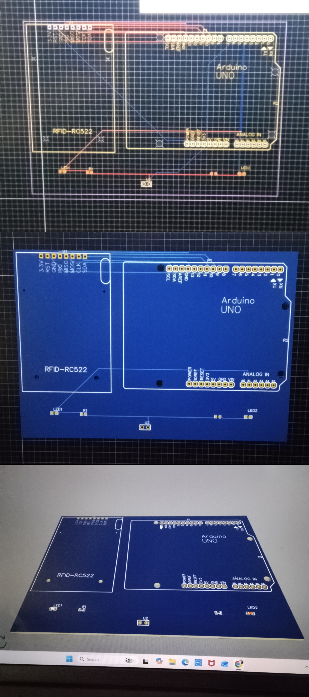

# 🔐 RFID-Based Access Control System

## 📌 Project Overview

A smart access control system built using **Arduino UNO** and **MFRC522 RFID module** that authenticates users via RFID cards. The system uses the **SPI communication protocol** for data transfer and provides visual and audio feedback through LED indicators and a buzzer.

- ✅ Simulated on **Wokwi**
- ✅ PCB Designed on **EasyEDA**
- ✅ Implements **SPI Protocol**

---

## ⚙️ Components Used

| Component | Specification |
|-----------|--------------|
| Microcontroller | Arduino UNO |
| RFID Module | MFRC522 |
| Green LED | Access Granted Indicator |
| Red LED | Access Denied Indicator |
| Buzzer | Audio Alert |
| Resistors | 220Ω |
| Power Supply | 5V via USB |

---

## 🔌 Pin Configuration

| MFRC522 Pin | Arduino UNO Pin |
|-------------|-----------------|
| SDA (SS) | Pin 10 |
| SCK | Pin 13 |
| MOSI | Pin 11 |
| MISO | Pin 12 |
| RST | Pin 9 |
| GND | GND |
| 3.3V | 3.3V |

| Component | Arduino Pin |
|-----------|-------------|
| Green LED | Pin 4 |
| Red LED | Pin 5 |
| Buzzer | Pin 6 |

---

## 🔧 How It Works

1. The MFRC522 module continuously scans for RFID cards
2. When a card is detected, its **UID** is read via **SPI protocol**
3. The UID is compared with the stored authorized UID
4. **Access Granted** → Green LED ON + Buzzer beeps once
5. **Access Denied** → Red LED ON + Buzzer beeps twice

---

## 📡 SPI Protocol

This project uses **Serial Peripheral Interface (SPI)** for communication between Arduino and MFRC522:
- **Full-duplex** communication
- **Master-Slave** architecture (Arduino = Master, MFRC522 = Slave)
- Data transfer at up to **10 MHz**
- Uses 4 lines: MOSI, MISO, SCK, SS

---

## 💻 Libraries Required

#include <SPI.h>
#include <MFRC522.h>

Install via Arduino IDE → Tools → Manage Libraries → Search MFRC522

---

## 🖥️ Simulation

This project was simulated on **Wokwi** before hardware implementation.
[🔗 View Wokwi Simulation](https://wokwi.com/projects/467695463514184705)

---

## 🖨️ PCB Design

PCB was designed using **EasyEDA** with proper trace routing for SPI communication lines.

---

## 🚀 How to Run

1. Clone this repository
git clone https://github.com/1-Lohima/RFID-Based-Access-Control-System.git

2. Open RFID Access Control System.ino in Arduino IDE
3. Install required libraries
4. Upload to Arduino UNO
5. Scan your RFID card!

---

## 👩‍💻 Author

**Lohima**
- 🎓 ECE Engineer | IEEE Member | Ideathon Winner
- 🏢 Intern @ Vishay Precision Transducers India Pvt Ltd
- 💼 TCS iON Certified

---

## 📄 License

This project is licensed under the MIT License - see the LICENSE file for details.
